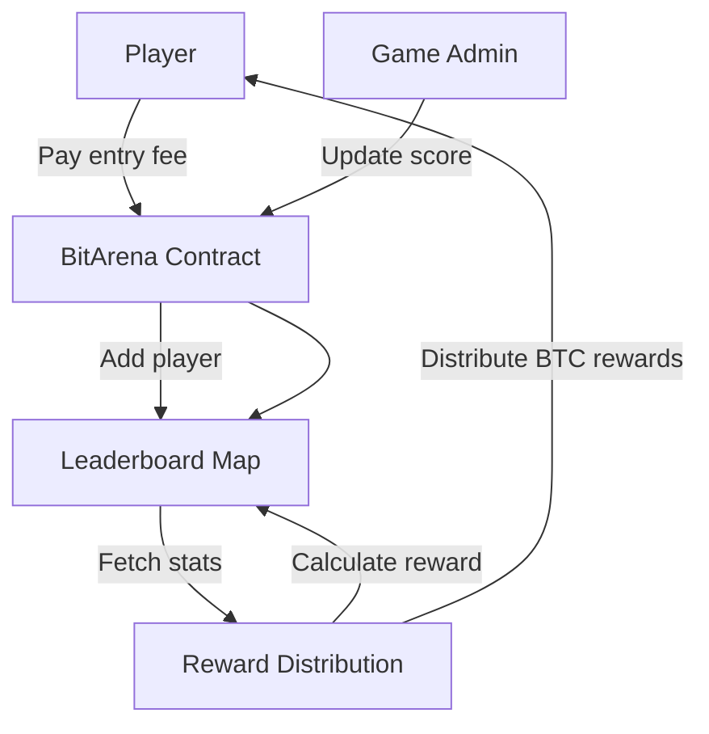

# BitArena - Competitive Gaming Protocol

## Overview

**BitArena** is a **Bitcoin Layer 2 competitive gaming protocol** built on **Stacks**, enabling **skill-based tournaments, NFT-based gaming assets, and automated Bitcoin prize pools**.

The protocol leverages Clarity smart contracts to provide **transparent leaderboards, verifiable scoring, and decentralized reward distribution**. It is designed to transform competitive gaming into a **trustless, Bitcoin-native ecosystem** where players maintain full ownership of assets while competing for BTC rewards.

---

## Features

* 🎮 **Skill-Based Tournaments** – Players register and compete based on performance, not chance.
* 🏆 **Automated Leaderboards** – On-chain tracking of scores, games played, and rewards.
* 💰 **BTC Prize Pools** – Entry fees and rewards flow into prize pools distributed to top players.
* 🧩 **NFT Game Assets** – Unique, tradable NFTs with metadata (rarity, power-level, attributes).
* 🔒 **Fair Play & Transparency** – Scoring and prize distribution are verifiable on-chain.
* 👤 **Admin Whitelisting** – Role-based admin system to initialize games and update scores securely.

---

## System Overview

The BitArena protocol is structured around three core components:

1. **Player Lifecycle**

   * Players register by paying a **game fee** in STX.
   * Each player is assigned a leaderboard entry with score tracking.
   * Scores are updated by authorized game admins.

2. **Game Asset Layer**

   * NFTs (`game-asset`) represent unique gaming collectibles.
   * Metadata includes **name, description, rarity, and power-level**.
   * Assets can be transferred between players securely.

3. **Reward Distribution**

   * Prize pools grow via player registration fees.
   * Rewards are calculated based on player performance (score-based).
   * Rewards accumulate in leaderboard entries for each player.

---

## Contract Architecture

### Constants & Config

* **Error Codes** – Standardized error handling (`ERR-NOT-AUTHORIZED`, `ERR-INVALID-SCORE`, etc.).
* **Game Variables** – `game-fee`, `max-leaderboard-entries`, `total-prize-pool`, `total-game-assets`.

### NFTs

* **`game-asset`** – Non-fungible token type.
* **`game-asset-metadata`** – Metadata map storing attributes (name, rarity, etc.).

### Player System

* **Leaderboard Map** – Stores `score`, `games-played`, and `total-rewards`.
* **Registration Flow** – Enforces entry fees and prevents duplicate registration.

### Admin Controls

* **Admin Whitelist** – Authorized principals to initialize tournaments and update scores.
* **Initialization** – Configurable game fees and leaderboard size.
* **Admin Actions** – Mint game assets, update scores, distribute rewards.

### Rewards

* **Reward Logic** – Score thresholds map to reward multipliers.
* **Distribution** – Iterates over valid leaderboard entries and assigns rewards.

---

## Data Flow

---

## Functions

### Admin

* `add-game-admin(new-admin)` – Adds a new admin.
* `initialize-game(entry-fee, max-entries)` – Configures game parameters.
* `mint-game-asset(name, description, rarity, power-level)` – Creates NFT assets.
* `update-player-score(player, new-score)` – Updates leaderboard entries.
* `distribute-bitcoin-rewards()` – Allocates rewards to top players.

### Player

* `register-player()` – Registers a new player (pays fee, joins leaderboard).
* `transfer-game-asset(token-id, recipient)` – Transfers NFT assets.

### Queries

* `get-top-players()` – Retrieves the current top-ranked players.
* `is-game-admin(sender)` – Checks admin status.
* `is-safe-principal(input)` – Validates a safe principal.

---

## Security Considerations

* **Role-based Admins** – Only whitelisted admins can update scores or manage rewards.
* **Input Validation** – All user inputs (strings, principals, scores) are validated.
* **Safe Transfers** – NFT and STX transfers use Clarity’s safe primitives (`try!`, `unwrap!`).
* **Fair Distribution** – Rewards are score-based and computed deterministically.

---

## Future Improvements

* **Dynamic Reward Pools** – Allow external sponsors to fund tournaments.
* **Game Oracles** – Integration with off-chain verifiable randomness or performance metrics.
* **Decentralized Governance** – DAO-based admin onboarding and parameter updates.
* **Advanced Leaderboard Sorting** – Implement ranked sorting for `get-top-players`.

---

## Deployment

1. Deploy the `BitArena` contract on Stacks.
2. The deployer is automatically added as the **first game admin**.
3. Admins configure **entry fees** and **leaderboard size**.
4. Players register, compete, and earn rewards.

---

## License

MIT License © BitArena Contributors
